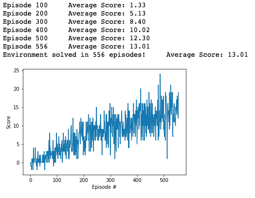

[//]: # (Image References)

[image1]: https://user-images.githubusercontent.com/10624937/42135619-d90f2f28-7d12-11e8-8823-82b970a54d7e.gif "Trained Agent"

# Deep Reinforcement Learning Project: Navigation

This project aims to train an agent to walk in a virtual environment (Banana Unity environment) and collect as many yellow bananas as possible while avoiding purple ones.

The trained agent in this project is a Deep Q-Networks (DQN) based agent.

![Trained Agent][image1]

This report consists of the following sections: 

* [1. Environment](#1-environment)
    
* [2. Implementation](#2-implementation)
    * [2.1 Deep Q-Networks model](#21-deep-q-networks-model)
    * [2.2 Experience replay](#22-experience-replay)
    * [2.3 DQN Agent](#23-dqn-agent)
    * [2.4 Training](#24-training)

* [3. Results](#3-results)

* [4. Future work](#4-future-works)


## 1. Environment

The environment chosen for the project is similar but not identical to the version of the [Banana Collector Environment](https://github.com/Unity-Technologies/ml-agents/blob/master/docs/Learning-Environment-Examples.md#banana-collector) from the Unity ML-Agents toolkit.

* A reward of +1 is provided for collecting a yellow banana and a reward of -1 is provided for collecting a blue banana. Thus, the goal of your agent is to collect as many yellow bananas as possible while avoiding blue bananas. Note that whenever the agent collects a banana, a new banana is spawn at a random place in the planar environment.

* The state space has 37 dimensions and contains the agent's velocity, along with ray-based perception of objects around agent's forward direction. Given this information, the agent has to learn how to best select actions. Four discrete actions are available, corresponding to:
    - **`0`** - move forward.
    - **`1`** - move backward.
    - **`2`** - turn left.
    - **`3`** - turn right.

* The task is episodic and the criteria solving the environment is to get **an average score of +13 over 100 consecutive episodes**.

Readers are recommended to read the Deep Q-learning algorithm [1] paper before diving into the project, it presents the theoretical foundations of the models, update rules, tweaks such as experience replay, target networks, soft updates, etc.

## 2. Implementation
### 2.1 Deep Q-Networks model

DQN is implemented as a neural network consisting of 1 input layer, 2 fully-connected hidden layers, and 1 output layer. The network can be described as follow:
* Input layer: 37 neurons (the state size)
* Fully-connected layer 1: 64 neurons, activation = ReLU
* Fully-connected layer 2: 64 neurons, activation = ReLU
* Output layer: 4 neurons (the action size)

This follows the [Udacity Q-network implementation](https://github.com/udacity/deep-reinforcement-learning/tree/master/dqn/solution). The implementation can be found under the `dqn_model.py` file.

```python
class DQN(nn.Module):
    """Actor (Policy) Model"""

    def __init__(self, state_size, action_size, seed, fc1_units=64, fc2_units=64):
        """Initialize parameters and build model.
        Params
        ======
            state_size (int): Dimension of each state
            action_size (int): Dimension of each action
            seed (int): Random seed
            fc1_units (int): Number of nodes in first hidden layer
            fc2_units (int): Number of nodes in second hidden layer
        """
        super(DQN, self).__init__()
        self.seed = torch.manual_seed(seed)
        self.fc1 = nn.Linear(state_size, fc1_units)
        self.fc2 = nn.Linear(fc1_units, fc2_units)
        self.fc3 = nn.Linear(fc2_units, action_size)

    def forward(self, state):
        """Build a network that maps state -> action values."""
        x = F.relu(self.fc1(state))
        x = F.relu(self.fc2(x))
        return self.fc3(x)
```

### 2.2 Experience replay

When the agent interacts with the environment, the sequence of experience tuples can be highly correlated. The naive Q-learning algorithm that learns from each of these experience tuples in sequential order runs the risk of getting swayed by the effects of this correlation. By instead keeping track of a  **replay buffer**  and using  **experience replay**  to sample from the buffer at random, we can prevent action values from oscillating or diverging catastrophically.

The  **replay buffer**  contains a collection of experience tuples (SS,  AA,  RR,  S′S′). The tuples are gradually added to the buffer as we are interacting with the environment.

The act of sampling a small batch of tuples from the replay buffer in order to learn is known as  **experience replay**. In addition to breaking harmful correlations, experience replay allows us to learn more from individual tuples multiple times, recall rare occurrences, and in general make better use of our experience.

The implementation of the **Replay Buffer** can be found under the `dqn_agent.py` file as `RelayBuffer` class.

```python
class ReplayBuffer:
    """Fixed-size buffer to store experience tuples."""

    def __init__(self, action_size, replay_buffer_size, minibatch_size, seed):
        """Initialize a ReplayBuffer object.

        Params
        ======
            action_size (int): dimension of each action
            buffer_size (int): maximum size of buffer
            batch_size (int): size of each training batch
            seed (int): random seed
        """
        self.action_size = action_size
        self.memory = deque(maxlen=replay_buffer_size)
        self.minibatch_size = minibatch_size
        self.experience = namedtuple("Experience", field_names=["state", "action", "reward", "next_state", "done"])
        self.seed = random.seed(seed)

    def add(self, state, action, reward, next_state, done):
        """Add a new experience to memory"""
        e = self.experience(state, action, reward, next_state, done)
        self.memory.append(e)

    def sample(self):
        """Randomly sample a batch of experiences from memory"""
        experiences = random.sample(self.memory, k=self.minibatch_size)

        states = torch.from_numpy(np.vstack([e.state for e in experiences if e is not None])).float().to(device)
        actions = torch.from_numpy(np.vstack([e.action for e in experiences if e is not None])).long().to(device)
        rewards = torch.from_numpy(np.vstack([e.reward for e in experiences if e is not None])).float().to(device)
        next_states = torch.from_numpy(np.vstack([e.next_state for e in experiences if e is not None])).float().to(
            device)
        dones = torch.from_numpy(np.vstack([e.done for e in experiences if e is not None]).astype(np.uint8)).float().to(
            device)

        return (states, actions, rewards, next_states, dones)

    def __len__(self):
        """Return the current size of internal memory."""
        return len(self.memory)
```

### 2.3 DQN Agent

With the above implementations, the DQN agent is implemented in `dqn_agent.py` as `DQNAgent` class.

- Replay Bufer is initialized to store the memory of the agent (`DQNAgent.memory`)
- Local network (`DQNAgent.dqn_local`) and Target network (`DQNAgent.dqn_target`) are initialized based on the model defined above
    - `DQNAgent.dqn_local:` this network is used for the training process
    - `DQNAgent.dqn_target:` this network is used to store the weights of the local network, and produce the action values to makes the training stable
- `DQNAgent.act()` returns actions for given state as per current policy. This is implemented using an Epsilon-greedy selection so that to balance between _exploration_ and _exploitation_ for the Q Learning)
- `DQNAgent.step()` 
    - Store a step taken by the agent (state, action, reward, next_state, done) in the Memory
    - Every 4 steps (and if their are enough experiences available in the Replay Buffer), sample the experiences from the Replay Buffer and `learn()` from that
- `DQNAgent.learn()` which minimize the loss of the expected Q-value and target Q-value. The Q-target and`soft_update()` the network
- `DQNAgent.soft_update()` copy the weights of the local network to the target network based on the rule described below:

 #### Hyper Parameters
The hyperparameters are chosen as follows:

```python
REPLAY_BUFFER_SIZE = int(1e5)   # size of our agent's memory
MINIBATCH_SIZE = 64             # size of the training batch
GAMMA = 0.99                    # discount factor
TAU = 1e-3                      # for soft update of target parameters
LR = 5e-4                       # learning rate
UPDATE_EVERY = 4                # soft update the network after every number of timesteps
```

The hyperparameters are self-described.

### 2.4 Training

The training process is implemented in the Navigation.ipynb notebook. The algorithm follows the process described in the [Deep Reinforement Learning Nanodegree](https://www.udacity.com/course/deep-reinforcement-learning-nanodegree--nd893).


```python
def train_dqn(n_episodes=2000, max_t=1000, eps_start=1.0, eps_end=0.01, eps_decay=0.995):
    """Deep Q-Learning.
    
    Params
    ======
        n_episodes (int): maximum number of training episodes
        max_t (int): maximum number of timesteps per episode
        eps_start (float): starting value of epsilon, for epsilon-greedy action selection
        eps_end (float): minimum value of epsilon
        eps_decay (float): multiplicative factor (per episode) for decreasing epsilon
    """
    scores = []                             # keep track of all the scores
    scores_window = deque(maxlen=100)       # keep track of the last 100 scores
    eps = eps_start
    for i_episode in range(1, n_episodes + 1):
        env_info = env.reset(train_mode=True)[brain_name]
        state = env_info.vector_observations[0]
        score = 0
        for t in range(max_t):
            action = agent.act(state, eps)
            env_info = env.step(action)[brain_name]
            
            next_state = env_info.vector_observations[0]
            reward = env_info.rewards[0]
            done = env_info.local_done[0]
            
            agent.step(state, action, reward, next_state, done)
            state = next_state
            score += reward
            if done:
                break
        scores_window.append(score)          # save most recent score
        scores.append(score)                 # save most recent score
        eps = max(eps_end, eps * eps_decay)  # decrease epsilon
    
        print('\rEpisode {}\tAverage Score: {:.2f}'.format(i_episode, np.mean(scores_window)), end="")
        if i_episode % 100 == 0:
            print('\rEpisode {}\tAverage Score: {:.2f}'.format(i_episode, np.mean(scores_window)))
        if np.mean(scores_window) >= BENCHMARK_SCORE:
            print('\nEnvironment solved in {:d} episodes!\tAverage Score: {:.2f}'.format(i_episode - 100,
                                                                                         np.mean(scores_window)))
            torch.save(agent.dqn_local.state_dict(), 'checkpoint.pth')
            break

    return scores
```
## 3. Results

This section presents the result of training and testing our DQN agent. 

#### Training scores



## 4. Future works

As discussed in the Deep Reinforement Learning course, we can improve our Deep Q-Networks by implementing some additional techniques:
- [Double DQN](https://arxiv.org/abs/1509.06461)
- [Dueling DQN](https://arxiv.org/abs/1511.06581)
- [Prioritized experience delay](https://arxiv.org/abs/1511.05952)
